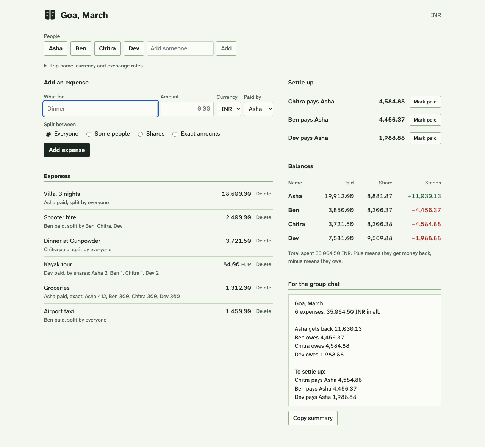

# evensplit

Settles up shared costs for a trip, a flat or a dinner without anyone signing up for an app. You add the people and
who paid for what, and it gives you the fewest payments that make everyone even ("Ben pays Asha 4,456.37"). The trip
is one JSON file on your computer.



Expenses can be split equally between everyone, equally between some people, by shares (2 for a couple, 1 for a
single), or by exact amounts. They can be in another currency with an exchange rate you set. When a payment is made,
"Mark paid" records it and the list updates. Deleting an entry can be undone from the bar at the bottom or with
Ctrl+Z (Cmd+Z on a Mac). "Copy summary" puts a plain-text version on the clipboard for the group chat.

## Run it

You need Rust 1.88 or newer, and Node 22 with pnpm to build the page.

```sh
cd web && pnpm install && pnpm build && cd ..
cargo build --release --features web
./target/release/evensplit-web goa.json                 # then open http://127.0.0.1:7676
./target/release/evensplit-web flat.json --currency INR # a new file starts in this currency
```

The page is built into the binary, so `evensplit-web` is the only file you need afterwards. It listens on 127.0.0.1
only. Every change is checked and then written to the trip file through a temporary file and a rename, so a crash
never leaves half a file.

There is also a command line version that needs no Node:

```sh
cargo build --release
./target/release/evensplit examples/goa.json
```

```
Goa, March: 6 expenses, 35,064.50 INR

             paid      share
Asha    19,912.00   8,881.87  gets back 11,030.13
Ben      3,850.00   8,306.37  owes 4,456.37
Chitra   3,721.50   8,306.38  owes 4,584.88
Dev      7,581.00   9,569.88  owes 1,988.88

To settle up:
  Chitra pays Asha   4,584.88
  Ben pays Asha      4,456.37
  Dev pays Asha      1,988.88
```

`--json` prints the same balances and payments as JSON, with amounts in minor units (paise, cents).

## The trip file

It is meant to be readable and editable by hand. Amounts are written as text, the way you would type them:

```json
{
  "name": "Goa, March",
  "currency": "INR",
  "rates": { "EUR": "90.25" },
  "people": ["Asha", "Ben", "Chitra", "Dev"],
  "expenses": [
    { "what": "Villa, 3 nights", "paid_by": "Asha", "amount": "18,600" },
    { "what": "Kayak tour", "paid_by": "Dev", "amount": "84", "currency": "EUR",
      "split": { "shares": { "Asha": 2, "Ben": 1, "Chitra": 1, "Dev": 2 } } }
  ],
  "payments": [{ "from": "Chitra", "to": "Asha", "amount": "4584.88" }]
}
```

A missing `split` means everyone. The others are `{ "equal": ["Ben", "Chitra"] }` and
`{ "exact": { "Asha": "412", "Ben": "300" } }`. The full example is in `examples/goa.json`.

## How it works

- Money is whole minor units in an `i64`, never a float. Each currency has its number of decimals (two for most, none
  for yen, three for dinars), and an amount with more decimals than its currency is an error rather than being rounded.
- An expense in another currency is converted once, with the rate as exact digits and rounding half away from zero.
  That is the only rounding between currencies.
- Splitting gives everyone the rounded-down share, then hands the units left over one each to the largest fractions.
  The parts always add up to the total. When fractions tie, as they do with equal splits, the odd paisa rotates: the
  first expense gives it to the first person, the second to the second, and so on, so it doesn't always land on the
  same person. A test splits 20,000 random totals and checks every one adds up, and another checks that balances on
  500 random trips in three currencies sum to exactly zero.
- Settle-up takes whoever owes the most, finds someone owed exactly that amount if there is one, otherwise whoever is
  owed the most, and has them pay as much as clears one of the two. Every payment clears at least one person, so a
  group of n never needs more than n - 1 payments, and nobody both pays and receives.

## How many payments

`cargo run --release --example bench` generates 1,000 trips for each group size, with 30 expenses each (most shared by
everyone, some by a few people, some by shares) from a fixed seed, and counts payments three ways: everyone paying back
each payer directly with debts netted within each pair, evensplit's settle-up, and the true minimum found by an
exhaustive search. Measured on an Apple Silicon Mac:

| People | Pay each payer back | evensplit | True minimum | Trips where evensplit hit the minimum |
| --- | --- | --- | --- | --- |
| 3 | 2.94 | 2.00 | 2.00 | 1,000 of 1,000 |
| 4 | 5.82 | 3.00 | 3.00 | 1,000 |
| 6 | 14.10 | 5.00 | 5.00 | 1,000 |
| 8 | 25.86 | 7.00 | 7.00 | 1,000 |
| 10 | 40.43 | 9.00 | 9.00 | 1,000 |
| 12 | 58.30 | 11.00 | 11.00 | 999 |

Payments are averages per trip. With amounts in whole hundreds of rupees the numbers are almost the same (998 of 1,000 at 12
people). Working out balances and payments for a trip took 11 to 25 µs (median). Settle-up alone for 1,000 people took
3.1 ms and for 5,000 people 68 ms.

Be careful reading the full marks: on trips like these almost everyone ends up owing or owed a different amount, and then
n - 1 payments is the minimum anyway. Finding the true minimum in general is a hard problem and evensplit doesn't try.
Small round numbers can catch it out: with balances of +3, +2, +4, -4 and -5 it asks for 4 payments, where 3 would do
(the person owing 4 pays the one owed 4, and the person owing 5 pays the other two).

## Limits

- One trip per file and one person editing at a time. Two browser tabs saving at once means the last save wins.
- Exchange rates are set by hand and one rate covers every expense in that currency, whatever the date.
- The trip's currency can't be changed once it has expenses, because amounts without a currency are in it.
- Someone who is in any expense, including one shared by everyone, can't be removed, only renamed.

## Tests

```sh
cargo test --features web   # 28 tests: amounts, rates, splits, balances, settle-up, saving
cd web && pnpm test         # 8 tests: amount input, defaults, undo, rename
```
